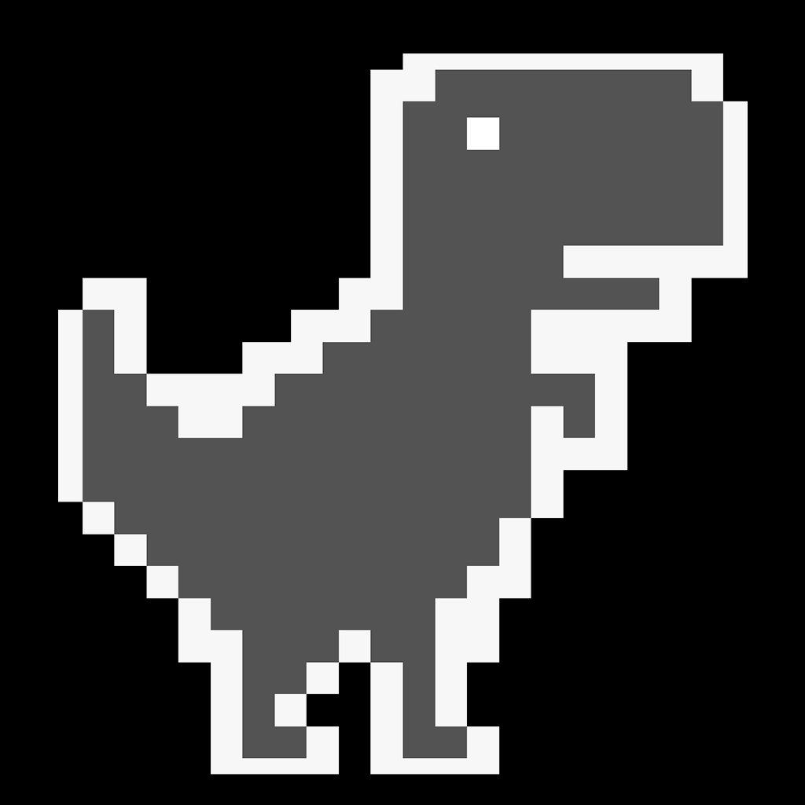
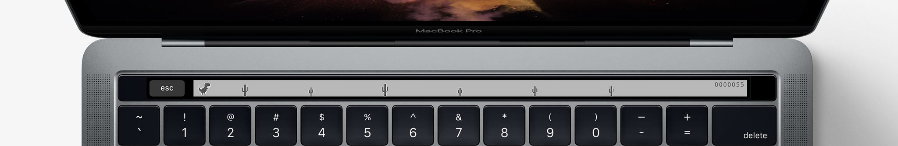

# TouchBarDino 
Who hasn't played the dinosaur game in Chrome when the internet goes down? But how about with Touch Bar?

TouchBarDino is a macOS app that simulates the dinosaur running game on the Touch Bar. It is written in Swift 3 and uses SpriteKit.

## How to play it
* Have the latest MacBook Pro with Touch Bar? Download the compiled game [here](https://github.com/yuhuili/TouchBarDino/raw/master/Compiled/Dino%202016-11-22%2020-23-19/Dino.zip)
* No? No worries, clone the repo and open it up in Xcode. Then go to Window->Show Touch Bar

